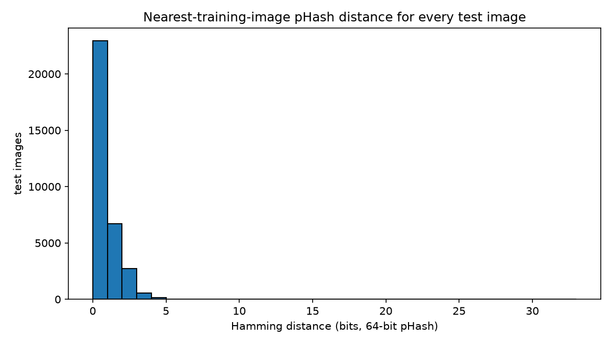
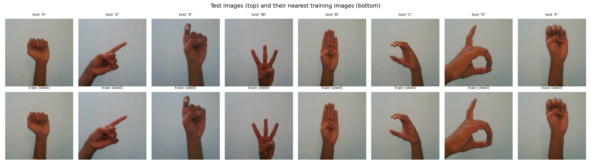
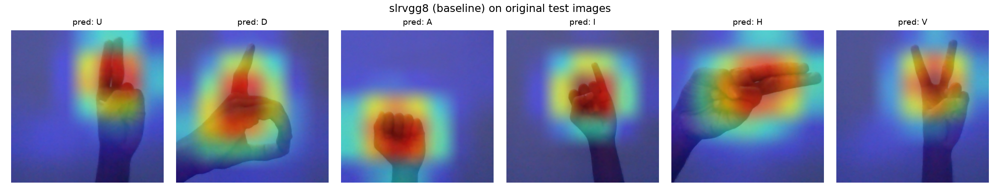
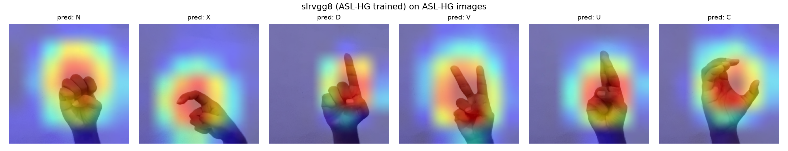

# ASL Recognition: Anatomy of a 100% Accuracy Score

> A CNN scored **100.000%** on a 33,128-image test set. This repository is the story of
> why that was a red flag rather than a triumph: how the leak was found, measured,
> fixed and what the honest numbers turned out to be.

This project began as group Computer Vision coursework (Bournemouth University,
Group 6) classifying American Sign Language gestures with three model families. I have
since restructured it from a single Jupyter notebook (preserved verbatim at
[`archive/Group_6_CV_2025.ipynb`](archive/Group_6_CV_2025.ipynb)) into this
repository, kept the original experiment reproducible, mistake included, and extended
it with a forensic investigation and a re-evaluation on an independent multi-signer
dataset. Every number in this README is generated by a script in `scripts/` and
stored in a committed JSON under `results/` - nothing is hand-copied from memory.

## TL;DR results

| Model | Trained on | Evaluated on | Protocol | Accuracy |
|---|---|---|---|---|
| SLRVGG-8 | Kaggle ASL (leaky split) | leaky test split (33,128 imgs) | random file-level split | **100.00%** |
| ASL_CNN | Kaggle ASL (leaky split) | leaky test split | random file-level split | 93.80%  |
| SLRVGG-8 | Kaggle ASL (leaky split) | ASL-HG letters, zero-shot (26,000 imgs) | masked A–Z | **23.35%** |
| ASL_CNN | Kaggle ASL (leaky split) | ASL-HG letters, zero-shot | masked A–Z | 5.89% (chance = 3.85%) |
| SLRVGG-8 | ASL-HG (signer-grouped split) | ASL-HG held-out signers (7,200 imgs) | honest | **75.53%** |
| ASL_CNN | ASL-HG (signer-grouped split) | ASL-HG held-out signers | honest | 13.19% |
| Pose + SVM | Kaggle ASL (leaky split) | leaky test split (30,261 detected) | random file-level split | 99.97% |
| Pose + SVM | ASL-HG (signer-grouped split) | ASL-HG held-out signers | honest | **84.04%** |
| SLRVGG-8 transfer (leaky backbone) | our own digits data | digits test (143 imgs) | corrected (disjoint split, real val) | 89.51% |
| SLRVGG-8 transfer (ASL-HG backbone) | our own digits data | digits test | corrected (disjoint split, real val) | **94.41%** |
| SLRVGG-8 transfer | our own digits data | digits test | invalid (test used as val) | ~~91.14%~~ |

The leak in one number: **69.27% of the 33,128 "test" images have a bit-for-bit
identical perceptual hash twin in the training set** (97.74% within 2 bits of 64).
The model was being scored on photographs it had effectively already seen.

---

## 1. Background

### Computer Vision
Computer Vision is the field of Artificial Intelligence that focuses on the creation of
computer models capable of interpreting 'visual' input like images and videos
(Browne & Ghidary, 2003). These models have applications across sectors: security
firms use CV facial-recognition models to improve surveillance capabilities, and CV
techniques have proven useful in medical imaging, identifying cancerous cells, among
others.

### Convolutional Neural Networks
An industry standard for computer vision today is the Convolutional Neural Network
(CNN), a form of deep neural network that removes the need for manual feature
extraction (Wu, 2017). The core components every CNN needs are convolutional,
pooling, and fully-connected layers.

The convolutional layer extracts feature representations by scanning its input with a
kernel to produce feature maps (Sultana, Sufian & Dutta, 2018); the kernel weights are
learned by backpropagation, and stacking layers yields increasingly complex features:
early layers detect edges, deep layers detect complex shapes. The pooling layer both
extracts secondary features and reduces dimensionality; Max and Average pooling are the
most common, and Bieder, Sandkühler & Cattin (2021) found the difference between these
and more sophisticated schemes negligible. Pooling handles deformation of information
through the network, though Ruderman et al. (2018) show pooling is neither necessary
nor sufficient for deformation stability; kernel smoothness also plays a role. The
fully-connected layer is a traditional neural network used to classify the CNN output.

The CNN concept traces to Fukushima's Neocognitron (Fukushima, 1980), a multi-layered
network inspired by mammalian visual cortex cells that learned to recognise visual
patterns hierarchically. LeCun et al. (1998) built on this with LeNet-5, a practical
CNN for document recognition, though performance at the time was limited by hardware
and training data. Datasets such as ImageNet, with 1,281,167 training images (Deng et al.,
2009), later drove the architecture evolutions of AlexNet, ZFNet, VGGNet, GoogLeNet
and SENet (Sultana, Sufian & Dutta, 2018).

### Pose Estimation
Pose estimation determines positions and orientations of objects from images: landmarks
such as joints, wrists, or digits are identified and localized (in 2D, via x/y
coordinates), and the landmark set composes an overall structure of the object in
focus. It underpins movement tracking, human pose estimation, and 3D reconstruction.
Here we use MediaPipe Hands (21 landmarks per hand) as the appearance-invariant
counterpart to the pixel-based CNNs.

### Aims
The original coursework aimed to produce three models classifying the ASL alphabet
(a baseline CNN, an SLRNet-8-inspired CNN, and a linear SVM over pose-estimation
features), evaluate them across accuracy, loss and F1, and transfer the best model to
a small self-collected digits dataset. This repository adds a fourth aim that only
became visible after submission: work out why the headline result was too good to be
true, then rebuild the evaluation until the numbers meant something.

## 2. Datasets

| Dataset | Images | Classes | Signers | Backgrounds | Role |
|---|---|---|---|---|---|
| [Kaggle ASL (Kapil Londhe, 2021)](https://www.kaggle.com/datasets/kapillondhe/american-sign-language) | 165,782 (116,125 / 16,529 / 33,128 after the coursework's split) | 28 (A–Z + Space + Nothing) | 1 | 1 studio | the original training set, and the leak |
| [ASL-HG (Hasan et al., 2025)](https://data.mendeley.com/datasets/j4y5w2c8w9/1) | 36,000 | 36 (A–Z + 0–9) | 10 | natural indoor + outdoor | independent multi-signer evaluation & honest retraining |
| Our own ASL digits dataset | 990 | 11 (0–9 + Nothing) | 3 (the coursework authors) | varied rooms/devices | transfer-learning target |

The Kaggle dataset's images are 400×400 studio captures of a single hand on a single
background: visibly consecutive capture frames. The coursework split it by randomly
*moving files* between Train/Val/Test folders; that historical split is preserved
untouched in `../ASL_Dataset` and treated as a frozen artifact (this repo never moves
files again; all new splits are non-destructive CSV manifests under
`data/manifests/`).

ASL-HG (CC-BY 4.0) was collected from 10 volunteers in Mirpur, Dhaka, with smartphone
cameras in natural environments. Crucially, signer identity is recoverable from
filenames (`P10_0_1000.jpg`), which allows a **signer-grouped split**: 7 signers train
/ 1 val / 2 test (25,200 / 3,600 / 7,200 images); no signer ever appears on both
sides of a boundary. That is the correct unit of independence for sign-language data.

Our digits dataset (990 images, 90 per class) was photographed by the three coursework
authors on different devices against varied backgrounds. Each image is at a unique
position, rotation and angle, deliberately high-variance. The coursework's 80/20
copy-split of it turned out to carry a leak of its own: the split script was
evidently run more than once, and each run copied a different random partition into
the same folders without clearing them, leaving 326 images present in both
`Digits_Train` and `Digits_Test` (90% of the test folder; measured in
`results/00_data_inventory.json`). This repo therefore ignores those folders and
splits the 990 source images directly, stratified 70/15/15 (693 train / 154 val /
143 test), disjoint by construction and asserted by the manifest checker.

## 3. Models

**SLRVGG-8** (`src/aslrec/models/slrvgg8.py`): the custom architecture I designed
for the coursework, a VGG-style redesign of SLRNet-8. Rahman et al. (2019) report
SLRNet-8 improving ASL recognition accuracy by ~9% over prior methods using six 5×5
convolutions; my version instead stacks seven 3×3 convolutions (the VGG/ResNet
insight that stacked small kernels outperform single large ones) with BatchNorm
after each, 512 filters in the deep layers (vs 384), global average pooling, and a
256-unit fully-connected head (vs 84) with dropout 0.5. That makes eight weight
layers counting the hidden FC (nine with the output layer); the -8 in the name is
inherited from SLRNet-8's depth designation. There is no explicit softmax, since
PyTorch's `CrossEntropyLoss` applies log-softmax internally.

**ASL_CNN** (`src/aslrec/models/asl_cnn.py`): a deliberately lightweight three-conv
CNN (LeNet/simplified-VGG inspired): 3×3 conv + BN + ReLU + max-pool blocks
(32→64→128), global average pooling, and a 256-unit head. Designed to trade accuracy
for fast training and lightweight inference on resource-constrained devices.

**Pose + SVM** (`src/aslrec/pose/`): MediaPipe Hands extracts 21 landmarks per image;
their (x, y) coordinates form a 42-dimensional feature vector feeding a linear SVM
(C selected on validation from {0.1, 1, 10}). Extraction is parallelized across CPU
cores with a shared-counter progress tracker and a resumable `.npz` cache.
*Transparency note: this pipeline existed in the coursework notebook but was never
executed there, and its plotting code contained bugs that would have crashed it
(a bar chart fed tuples, plus a colorbar on a bar plot). Both are fixed here and the
pipeline actually runs; see Sect. 9.*

Training engine (`src/aslrec/engine/train.py`), shared by every stage: Adam (lr 1e-3),
CrossEntropyLoss, `ReduceLROnPlateau` on validation loss, early stopping on validation
accuracy, best-checkpoint saving. Seeds are fixed (`--seed 42`) across python, numpy
and torch, with deterministic cuDNN.

### Augmentation, and a correction
Data augmentation combats overfitting by exposing the network to controlled variation
(Lemley, Bazrafkan & Corcoran, 2017). The coursework stack: resize to 224×224, random
rotation ±15°, grayscale conversion (3-channel), random affine (±10% translation,
90–110% scale), and a random horizontal flip, which I have removed. ASL handshapes
are chiral: a mirrored sign is what the *other* hand produces, and several letters are
not mirror-symmetric, so flipping teaches geometries that do not belong to the class.
The legacy stack survives behind `build_train_transforms(legacy=True)` solely so the
original result can be reproduced exactly.

---

## 4. Act I: the suspicious perfect score

Reproduced from the historical checkpoints by `scripts/02_eval_baseline.py`
(results: `results/02_eval_baseline.json`):

| Model | Test accuracy | n |
|---|---|---|
| SLRVGG-8 | **1.000000** (zero errors) | 33,128 |
| ASL_CNN | 0.938028 | 33,128 |

SLRVGG-8's coursework training log reached 99.95% *validation* accuracy after a
single epoch (the recipe is re-runnable from scratch via
`scripts/01_train_baseline.py --force`; by default the historical checkpoint is
evaluated directly). Every class:
precision 1.00, recall 1.00, F1 1.00 (confusion matrix:
`reports/figures/02_slrvgg8_confusion.png`).

A perfect score across 33k images essentially never happens on a real vision problem.
The coursework notebook reported it as success ("the model misclassified none"); the
correct reading is that the evaluation was broken. The notebook also disagrees with
itself in places, claiming 95.95% for ASL_CNN in prose while its own cell output says
93.80%. That class of error is why every number in this README is read out of a
committed JSON rather than typed from memory.

## 5. Act II: the investigation

To find out where the score came from, I perceptually hashed all 116,125 training
and 33,128 test images (64-bit pHash) and computed, for every test image, the
Hamming distance to its nearest same-class training image
(`scripts/03_investigate_leakage.py`, `results/03_leakage.json`):

| Nearest-train distance | Share of test set |
|---|---|
| 0 bits (identical hash) | **69.27%** |
| ≤ 2 bits | **97.74%** |
| ≤ 4 bits | 99.90% |
| ≤ 8 bits | 100.00% |

Median distance: **0 bits**. Every single test image sits within 8 bits of a training
image.



The pairs themselves make the mechanism obvious: these are consecutive frames of the
same capture session (test frame vs its nearest training frame):

| Class | Test frame # | Nearest train frame # | Gap | Hamming |
|---|---|---|---|---|
| A | 1141 | 1138 | 3 | 0 |
| A | 1143 | 1138 | 5 | 0 |
| Z | 90 | 87 | 3 | 0 |



The mechanism, then: the dataset is one signer photographed in long bursts against
one background, so each class is a few runs of near-identical frames. A random
file-level split scatters each run across Train/Val/Test, and "generalizing to the
test set" reduces to recognizing an almost-pixel-identical copy of a training image.
The model never had to learn what an 'A' is, only what these specific photographs
look like. No split of this dataset can fix that; the split unit has to match the
unit of independence (capture sessions, signers), and this dataset contains only one
of each.

## 6. Act III: the collapse, and the honest numbers

### Zero-shot cross-dataset evaluation
The prediction this analysis makes is that the "100%" models should fall apart on
anyone else's hands. To test it, `scripts/04_cross_dataset_eval.py` evaluates the
unchanged checkpoints on all 26,000 A–Z images of ASL-HG (10 different signers,
natural backgrounds), under two protocols: *masked* restricts the argmax to the 26
shared letter logits (fair); *unmasked* lets the model predict any of its 28
classes, counting Space/Nothing predictions as errors (strict). Results
(`results/04_cross_dataset_eval.json`):

| Model | ASL-HG raw (masked / unmasked) | ASL-HG MediaPipe-cropped (masked / unmasked) |
|---|---|---|
| SLRVGG-8 | **23.35% / 18.39%** | 10.67% / 7.50% |
| ASL_CNN | 5.89% / 0.30% | 8.08% / 2.47% |

Chance on 26 classes is 3.85%. The model that "misclassified none" of 33k images
misclassifies roughly three out of four real-world images from other hands, and the
lightweight CNN performs at or near chance. One detail I did not expect: SLRVGG-8
does worse on the hand-cropped variant than on raw photos, which suggests part of
what it learned is not hand geometry at all. Per-class bars are in
`reports/figures/04_*_per_class.png` (J and Z carry an extra caveat, being dynamic
gestures whose static renderings differ between datasets).

### Retraining honestly on ASL-HG
I then retrained both architectures from scratch on ASL-HG's signer-grouped split
with the corrected augmentation stack (`scripts/05_train_aslhg.py`,
`results/05_train_aslhg_raw.json`):

| Model | Val (held-out signer) | Test (2 held-out signers, n=7,200) | Macro F1 |
|---|---|---|---|
| SLRVGG-8 | 77.86% (best, epoch 14/19) | **75.53%** | 0.7426 |
| ASL_CNN | 16.39% (best, epoch 2/7) | 13.19% | 0.0731 |

75.5% on people the model has never seen is the number the 100% should have been:
lower, defensible, and actually meaningful for a from-scratch CNN on a 36-class
problem with signer-level generalization. The roughly 25-point gap to perfection is
what the leaky evaluation had been hiding.

This stage also finally explained ASL_CNN's odd behaviour. In the coursework its
validation accuracy oscillated wildly (5%–96% across epochs) even on the easy
dataset, which the notebook observed but could not explain. On diverse data it fails
outright at the coursework's lr=1e-3 (13.2%, same oscillation), so I re-ran it at
lr=1e-4 as a diagnostic (`results/05_train_aslhg_raw_lr1e-4.json`). Training
stabilized into a smooth climb and test accuracy nearly doubled to 25.3%, which
pins part of the instability on optimization: the learning rate was too high for a
small BatchNorm network. The rest is capacity, since even stabilized it sits 50
points behind SLRVGG-8. A 128-channel, 3-conv network with global average pooling
cannot carry 36-class signer-invariant recognition, and the coursework's "well
suited for edge deployment" framing needed both asterisks.

The domain gap also turned out to run both ways: the ASL-HG-trained SLRVGG-8 scores
only 20.45% (masked) back on the original studio dataset's letters. Different
capture setup, different visual world, in either direction.

## 7. Transfer learning to our own digits data, done twice

Transfer learning reuses a pre-trained model on a new problem: replacing a CNN's
fully-connected head lets the convolutional features serve a new label set, an
approach validated on pre-trained VGG-family backbones by Shaha and Pawar (2018).
`scripts/06_transfer_digits.py` freezes each backbone's convolutional features and
retrains the classifier head on our 990-image self-collected digits dataset, exactly
the coursework experiment, with the protocol repaired twice over. The coursework's
91.14% was invalid two ways: it early-stopped on the test set (model selection on
test), and its underlying Train/Test folders overlapped by 326 images (Sect. 2), so 90%
of its test images were also trained on. Here the split is rebuilt disjoint from the
990 source images, selection uses the validation split, and the test set is touched
once (`results/06_transfer_digits.json`):

| Backbone | Digits test accuracy | Macro F1 |
|---|---|---|
| SLRVGG-8 trained on leaky Kaggle ASL | 89.51% | 0.8947 |
| SLRVGG-8 trained on ASL-HG (honest) | **94.41%** | 0.9435 |
| Coursework protocol (invalid: test as val + overlapping split) | ~~91.14%~~ | n/a |

The second row is the result I find most satisfying in the whole project: the
backbone trained on diverse multi-signer data transfers 4.9 points better than the
one that memorized a single hand, despite that backbone's "perfect" pedigree.
Whatever the leaky model memorized, it was less useful downstream than what the
honest model learned. (One caution on reading the absolute numbers: the disjoint
test set is small, 143 images, so they carry meaningful variance; the
backbone-to-backbone comparison, run on the identical split, is the robust claim.)

## 8. What the models look at (Grad-CAM)

Grad-CAM (Selvaraju et al., 2019) produces visual explanations by weighting the final
convolutional layer's feature maps with the gradients of the predicted class score,
applicable to any CNN without architectural changes, unlike earlier CAM methods
(Priya, 2023). I implemented it directly with autograd hooks rather than a library
(`src/aslrec/gradcam.py`): forward/backward hooks on the last Conv2d,
global-average-pooled gradients as channel weights, and the ReLU'd, normalized
activation map overlaid on the input (Vishwakarma, 2025).




On its home dataset the baseline model's activation sits plausibly on the hand, which
is exactly why Grad-CAM alone was not enough to certify the model in the coursework:
attention maps can look right while the evaluation is broken. The full six-grid
comparison (`reports/figures/07_*.png`) adds the baseline models on ASL-HG images
(where attention still lands near the hand but repeatedly bleeds onto blank background
regions and the predictions go wrong) and the honest models on ASL-HG, whose
activation centres on hand geometry across different signers and backgrounds.

## 9. The pose + SVM control experiment

MediaPipe landmark features describe *where the hand's joints are*, not what the
pixels look like, which makes the linear SVM the natural control for the CNN
results. `scripts/08_pose_svm.py` runs it on both datasets
(`results/08_pose_svm.json`); detection-failure rates ('Nothing'/'Space' images
genuinely contain no hand) are reported rather than silently dropped: 8.6% on the
original dataset (dominated by its two hand-less classes), ~0% on ASL-HG.

| Trained on | Evaluated on | Accuracy | Best C |
|---|---|---|---|
| original (leaky split) | leaky test split (30,261 detected hands) | **99.97%** | 10 |
| ASL-HG (signer split) | 2 held-out signers (n=7,200) | **84.04%** (macro F1 0.8298) | 10 |
| original (leaky split) | ASL-HG letters, zero-shot (n=5,200) | 9.62% | n/a |

The first row settles something important: the leak was never a CNN problem. A
42-feature linear SVM also "solves" the leaky split at 99.97%, because near-duplicate
frames have near-duplicate keypoints. Whatever model you plug into a broken
evaluation comes out looking excellent, which is why the dataset, not the model, had
to be fixed.

On the honest signer split the landmark pipeline takes the top score, 84.0% against
SLRVGG-8's 75.5%. Landmarks discard skin tone, lighting and background by
construction, so signer-invariance comes largely for free, and that turns out to be a
better inductive bias for this task than learned pixel features. None of this was
visible under the leaky evaluation, where the CNN's memorized 100% looked
unbeatable. One asymmetry should be kept in view when reading that comparison: it is
not from-scratch vs from-scratch. The pipeline's 42 features come from MediaPipe
Hands, Google's landmark model pretrained on hand data at industrial scale, and the
linear SVM on top is trivial, whereas SLRVGG-8 learned everything it knows from
25,200 images of seven signers. Landing within 8.5 points of a pretrained industrial
extractor is a result I am happy with.

The third row is the caveat. Zero-shot from the original dataset to ASL-HG, the SVM
manages only 9.62%: above chance (3.85%), far from usable. The features are absolute
(x, y) image coordinates, so hand position, scale and framing differences between
capture setups swamp the pose signal. Wrist-relative, scale-normalized coordinates
are the obvious next step; "invariant features" still require the invariances to be
engineered.

### How the custom architecture held up overall

The signer-split defeat is the only test SLRVGG-8 lost; it won every other
comparison in this repo. Against the other from-scratch CNN it scored 75.5% to
ASL_CNN's 13.2% on the honest split (Sect. 6), a 62-point gap that comes down to depth,
stacked 3×3 kernels, BatchNorm and global average pooling. On cross-dataset
transfer, the Kaggle-trained SLRVGG-8 moved to ASL-HG at 23.35% masked (Sect. 6) where
the Kaggle-trained SVM managed 9.62%, so its learned features travelled better
across capture setups than raw landmarks did. As a transfer backbone, its frozen
features reached 94.4% on our digits dataset (Sect. 7), the best downstream result in
the project. And it covers the hand-less 'Nothing' and 'Space' classes that the
pose pipeline cannot represent at all, since MediaPipe returns no features for
8.6% of the original dataset, concentrated in exactly those classes.

So the fair summary is that the custom CNN is the strongest learned-from-scratch
model here, and the one head-to-head it lost was against a pretrained industrial
landmark extractor, for a reason (appearance invariance) the leaky evaluation had
made invisible. Combining the two, normalized landmark features alongside CNN
features or fine-tuning a pretrained hand encoder, is the clearest next step this
project points to.

## 10. What I take away from this

The biggest lesson is to treat a perfect score as a symptom. The 100% meant the
evaluation could not measure generalization at all, and proving why took an
afternoon of perceptual hashing rather than any modelling work. Related, and less
obvious to me at the time: a broken evaluation flatters every model equally. The
SVM also scored 99.97% on the leaky split, so any model comparison run under that
protocol was meaningless, and the real ranking only appeared once the evaluation
was fixed (at which point it inverted, and the landmark pipeline won).

The rest are protocol habits this project burned in:

1. Split on the unit of independence. Frames from one capture session are
   effectively one sample; sign-language data has to be split by signer or session,
   for the same reason medical imaging is split by patient rather than by scan.
2. Touch the test set once. The coursework's digits number came from early stopping
   on the test set, which makes it a selection artifact, not an estimate.
3. Augmentation has semantics. Horizontal flips are free accuracy on natural photos
   and wrong for a chiral gesture alphabet.
4. Attention maps do not audit accuracy; Grad-CAM looked perfectly reasonable on a
   model whose evaluation was broken.
5. Write reports from artifacts. The notebook's prose disagreed with its own cell
   outputs (95.95% vs 93.80%); every number here is read out of a committed JSON.

And the constructive finding I keep coming back to: the honestly-trained backbone
transferred 4.9 points better to our own digits data than the leaky one did. Fixing
the evaluation did not just lower a number, it produced a better model.

One postscript that belongs in this section: the digits overlap (Sect. 2) was caught by
arithmetic, not suspicion. An earlier draft of this README quoted split counts that
summed to 1,316 images against a 990-image dataset, which is impossible without
duplication, and auditing that discrepancy exposed the overlapping folders. The
first version of my corrected experiment had inherited them, so its numbers were
contaminated too and had to be re-measured on a rebuilt split. The manifest checker
now asserts cross-split filename disjointness so this cannot recur silently. Same
lesson as the 100%: check the arithmetic, and audit anything you inherited.

## 11. Reproducing

```powershell
# Windows, Python 3.12, NVIDIA GPU (RTX 50-series needs torch>=2.7 cu128 wheels)
py -3.12 -m venv .venv           # or: uv venv --python 3.12 .venv
uv pip install --python .venv -r requirements.txt

# smoke-test everything first (tiny subsets, ~minutes)
.venv\Scripts\python tests\test_smoke.py
.venv\Scripts\python scripts\00_prepare_data.py        # inventories + manifests + ASL-HG download (~5.6 GB)
.venv\Scripts\python scripts\02_eval_baseline.py       # reproduce the 100%
.venv\Scripts\python scripts\03_investigate_leakage.py # the pHash forensics (~15 min CPU)
.venv\Scripts\python scripts\04_cross_dataset_eval.py  # the collapse
.venv\Scripts\python scripts\05_train_aslhg.py         # honest retrain (~40 min on RTX 5070)
.venv\Scripts\python scripts\06_transfer_digits.py     # digits transfer, both backbones
.venv\Scripts\python scripts\07_gradcam_compare.py
.venv\Scripts\python scripts\08_pose_svm.py            # MediaPipe + SVM (CPU-heavy)
```

Every script accepts `--smoke` (tiny 1-epoch validation run), `--seed`, and
`--device`. Stage 01 (`01_train_baseline.py`) re-trains the flawed baseline from
scratch and is optional; by default the historical coursework checkpoints in
`../checkpoints/` are evaluated directly.

Expected layout: this repo sits next to the original coursework data
(`../ASL_Dataset`, `../ASL_Digits_Dataset`, `../Digits_Train`, `../Digits_Test`,
`../checkpoints`), with paths configurable in `config.yaml`. ASL-HG downloads
automatically from Mendeley into `data/aslhg/`.

## 12. Repository map

```
src/aslrec/          the library: models, data (manifest-based splits, transforms),
                     training/eval engine, leakage forensics, Grad-CAM, pose+SVM
scripts/00–08        the narrative pipeline, numbered in story order
results/*.json       committed metrics, the single source of truth for this README
reports/figures/     committed figures referenced above
archive/             the original coursework notebook, preserved verbatim
data/                gitignored working area (ASL-HG download, caches, manifests)
checkpoints/         gitignored model weights produced by this repo
tests/test_smoke.py  port-fidelity gate: the coursework checkpoints must load
                     strict=True into the ported architectures
```

### The archived notebook

The original coursework notebook is committed verbatim, outputs and all, at
[`archive/Group_6_CV_2025.ipynb`](archive/Group_6_CV_2025.ipynb). It is the primary
source for every claim this report makes about the original work; nothing in it has
been edited or re-run. Its known defects, each preserved there and fixed here:

| Defect in the notebook | Where it is visible | Fixed by |
|---|---|---|
| 100.00% test accuracy reported as success | SLRVGG-8 training/evaluation cells | Sects. 4–6, `scripts/02–05` |
| Prose claims 95.95% for ASL_CNN; its own cell output says 93.80% | CNN evaluation section | every number here traces to `results/*.json` |
| Prose claims "eight convolutions" for SLRVGG-8; the code implements seven | SLRVGG-8 markdown vs its class definition | Sect. 3, accurate layer count and naming rationale |
| Digits transfer early-stops on the test set (91.14%) | transfer-learning loop | Sect. 7, real val split in `scripts/06` |
| Digits copy-split run repeatedly: 326 images in both Train and Test folders | `Digits_Train`/`Digits_Test` on disk (audited in `results/00_data_inventory.json`) | Sect. 2 and Sect. 7, disjoint 70/15/15 split from source, asserted by the manifest checker |
| Pose+SVM section never executed; plotting code would crash | SVM cells have no outputs | Sect. 9, fixed and run in `scripts/08` |
| RandomHorizontalFlip on chiral handshapes | augmentation cell | Sect. 3, corrected transform stack |
| Destructive `shutil.move` dataset splitting | data pre-processing cell | non-destructive CSV manifests (`src/aslrec/data/splits.py`) |

## 13. Attribution

This project began as Bournemouth University group coursework (Group 6, 2025),
built by three authors.

My individual contributions in the original coursework: the SLRVGG-8 architecture
(design and implementation), the Grad-CAM interpretability implementation, and the
transfer-learning experiment. My two teammates contributed the pose-estimation + SVM
pipeline and the lightweight ASL_CNN baseline, and all three of us contributed hand
photographs to the self-collected digits dataset.

Everything beyond that, the restructuring into this repository, the leakage
investigation, the cross-dataset evaluation, the honest retraining, and the corrected
protocols (2026), is my individual work. The original notebook's flaws are kept
visible throughout, deliberately: this repository is meant to show the process, not
just the result.

## References

1. Bieder, F., Sandkühler, R. and Cattin, P.C. (2021). Comparison of Methods Generalizing Max- and Average-Pooling. https://doi.org/10.48550/arXiv.2103.01746
2. Browne, M. and Ghidary, S.S. (2003). Convolutional Neural Networks for Image Processing: An Application in Robot Vision. *Lecture Notes in Computer Science*, pp. 641–652. https://doi.org/10.1007/978-3-540-24581-0_55
3. Deng, J., Dong, W., Socher, R., Li, L.-J., Li, K. and Fei-Fei, L. (2009). ImageNet: A large-scale hierarchical image database. *2009 IEEE Conference on Computer Vision and Pattern Recognition*. https://doi.org/10.1109/cvpr.2009.5206848
4. Fukushima, K. (1980). Neocognitron: A self-organizing neural network model for a mechanism of pattern recognition unaffected by shift in position. *Biological Cybernetics*, 36(4), pp. 193–202. https://doi.org/10.1007/bf00344251
5. Karl (2023). ResNet34 first layer 7x7 or 3x3 (answer 2). StackOverflow. https://stackoverflow.com/questions/77704426/resnet34-first-layer-7x7-or-3x3
6. LeCun, Y., Bottou, L., Bengio, Y. and Haffner, P. (1998). Gradient-based learning applied to document recognition. *Proceedings of the IEEE*. https://ieeexplore.ieee.org/document/726791
7. Lemley, J., Bazrafkan, S. and Corcoran, P. (2017). Smart Augmentation: Learning an Optimal Data Augmentation Strategy. *IEEE Access*, 5, pp. 5858–5869.
8. Priya, C. (2023). How to Explain ConvNet Predictions Using Class Activation Maps. Pinecone. https://www.pinecone.io/learn/class-activation-maps
9. Rahman, M. et al. (2019). A New Benchmark on American Sign Language Recognition Using Convolutional Neural Network. *International Conference on Sustainable Technologies for Industry*. https://doi.org/10.1109/STI47673.2019.9067974
10. Ruderman, A., Rabinowitz, N.C., Morcos, A.S. and Zoran, D. (2018). Pooling is neither necessary nor sufficient for appropriate deformation stability in CNNs. https://doi.org/10.48550/arXiv.1804.04438
11. Selvaraju, R.R. et al. (2019). Grad-CAM: Visual Explanations from Deep Networks via Gradient-based Localization. *International Journal of Computer Vision*. https://doi.org/10.48550/arXiv.1610.02391
12. Shaha, M. and Pawar, M. (2018). Transfer Learning for Image Classification. *2018 Second International Conference on Electronics, Communication and Aerospace Technology (ICECA)*.
13. Sultana, F., Sufian, A. and Dutta, P. (2018). Advancements in Image Classification using Convolutional Neural Network. https://doi.org/10.1109/ICRCICN.2018.8718718
14. Vishwakarma, N. (2025). A Guide to Grad-CAM in Deep Learning. Analytics Vidhya. https://www.analyticsvidhya.com/blog/2023/12/grad-cam-in-deep-learning
15. Wu, J. (2017). Introduction to Convolutional Neural Networks. Nanjing University.
16. Kapil Londhe (2021). American Sign Language [Data set]. Kaggle. https://doi.org/10.34740/kaggle/dsv/2184214
17. Hasan, M.M. et al. (2025). ASL-HG: American Sign Language Hand Gesture Image Dataset. Mendeley Data, V1. https://doi.org/10.17632/j4y5w2c8w9.1 (CC BY 4.0)
18. Lugaresi, C. et al. (2019). MediaPipe: A Framework for Building Perception Pipelines. https://doi.org/10.48550/arXiv.1906.08172
